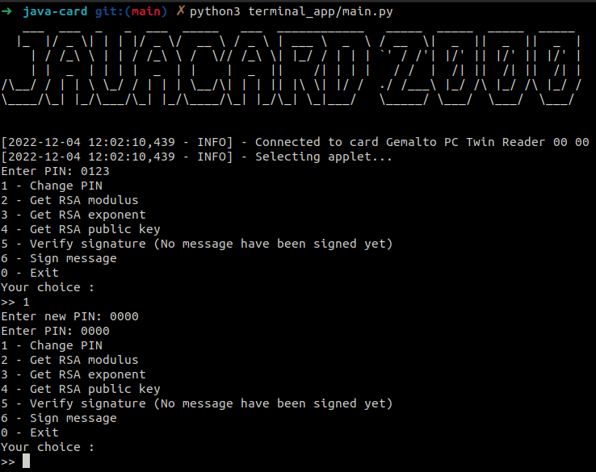
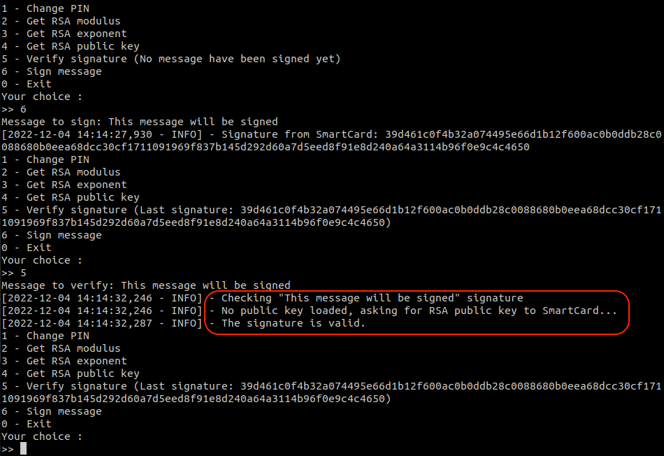
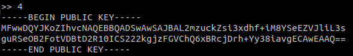
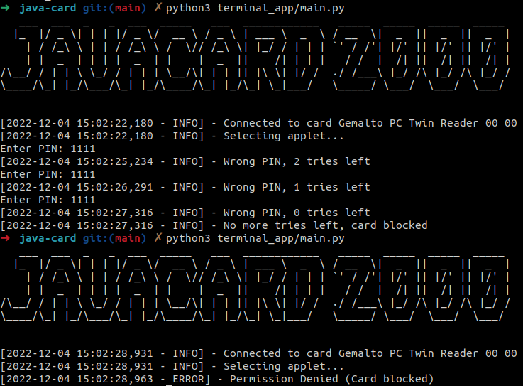

# JavaCard

This project implements cryptography algorithms for Java Card 2.1.1. RSA and SHA-1 are used for the signature. The algorithm is based on the [PKCS#1 v1.5](http://tools.ietf.org/html/rfc2313) standard.


## Set up project environment

Export sdk path to environment variable `JC_HOME`:

    export JC_HOME=/path/to/java_card_kit-2_1_1

Export JAVA_HOME to environment variable `JAVA_HOME`:

    export JAVA_HOME=/usr/lib/jvm/zulu-8-amd64/
Export PATH to environment variable `PATH`:

    export PATH=$JAVA_HOME/bin:$JC_HOME_TOOLS/bin:$PATH


## How to use

1. Install dependencies:
```
make install
```

2. Compile and install the applet:
```
make
```

3. Run client side application:
```
python3 terminal_app/main.py
```

## Good to know

List all applets on smartcard:
```
make list_apps
```

Upload applet `smart_card/AppletJavaCard.java`:

```
make install_applet
```

Delete applet:
```
make uninstall_applet
```

### Exemples








